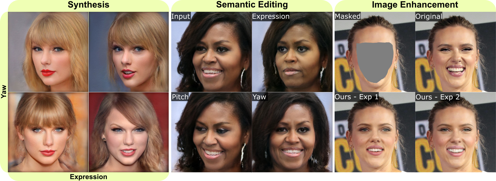

# MyStyle++: A Controllable Personalized Generative Prior



### [Project Page](https://libingzeng.github.io/projects/mystyle++/mystyle++.html) | [Paper](https://arxiv.org/pdf/2306.04865.pdf)

[MyStyle++: A Controllable Personalized Generative Prior](https://libingzeng.github.io/projects/mystyle++/mystyle++.htm)  
 [Libing Zeng](https://libingzeng.github.io/)<sup>1</sup>, [Lele Chen](https://lelechen63.github.io/)<sup>2</sup>, [Yi Xu](https://www.linkedin.com/in/yi-xu-42654823/)<sup>3</sup>, [Nima Khademi Kalantari](https://www.cs.tau.ac.il/~dcor/)<sup>1</sup> 

<sup>1</sup> Texas A&M University, <sup>2</sup> Sony AI, <sup>2</sup> OPPO US Research Center

## Setup

Code was tested with Python 3.9.5, Pytorch 1.9.0 and CUDA 11.4.

We provide a yml file to easy setup of a conda environment. 


```
conda env create -f mystyle_pp_env.yml
```


## Citation

```
@article{Zeng_2023_mystyle++,
    author = {Zeng, Libing and Chen, Lele and Xu, Yi and Kalantari, Nima Khademi},
    title = {MyStyle++: A Controllable Personalized Generative Prior},
    booktitle={ACM SIGGRAPH Asia},
    year={2023}
}
```

## Acknowledgements

This implementation is adapted from [MyStyle](https://github.com/google/mystyle). We gratefully acknowledge the authors for their outstanding work.
